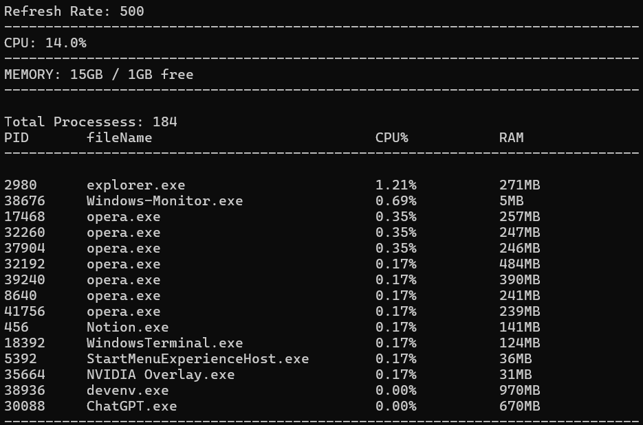

# Windows Monitor

## Requirements
- Visual Studio 2022
- Windows 10/11
- C++20

## Introduction
Windows Monitor is a system monitoring tool similar to Task Manager, built using Windows Native APIs (Win32).  
The project focuses on learning Windows internals, process management, and system resource monitoring using C++.

## Features 
- Real time CPU monitoring
- Per process CPU usage & memory usage
- Sorted and top 15 process list
- Built using Windows Native APIs (Win32)

## Architecture
- **CPU module** fetches system information on user, kernel. This then later be calculated over overtime.
- **Memory module** gets total & available physical memory. 
- **Process module** enumerate each process using a snapshot from which per process cpu, memory is calculated over time. 
- **Monitor controller** brings all the modules together into two main methods.

## Resources
- https://learn.microsoft.com/en-us/windows/win32/api/processthreadsapi/nf-processthreadsapi-getsystemtimes
- https://learn.microsoft.com/en-us/windows/win32/api/sysinfoapi/nf-sysinfoapi-globalmemorystatusex
- https://learn.microsoft.com/en-us/windows/win32/api/tlhelp32/nf-tlhelp32-createtoolhelp32snapshot
- https://learn.microsoft.com/en-us/windows/win32/api/tlhelp32/nf-tlhelp32-process32first
- https://learn.microsoft.com/en-us/windows/win32/api/processthreadsapi/nf-processthreadsapi-openprocess
- https://learn.microsoft.com/en-us/windows/win32/api/processthreadsapi/nf-processthreadsapi-getprocesstimes
- https://learn.microsoft.com/en-us/windows/win32/api/psapi/ns-psapi-process_memory_counters

## Screenshot

